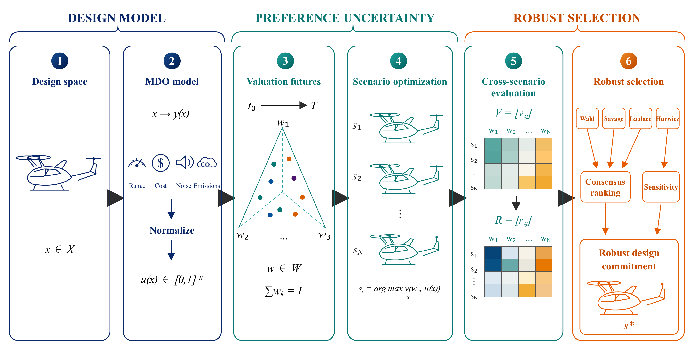
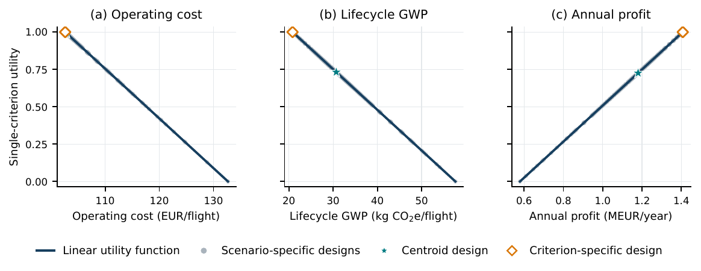
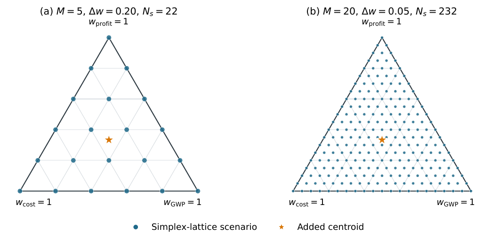
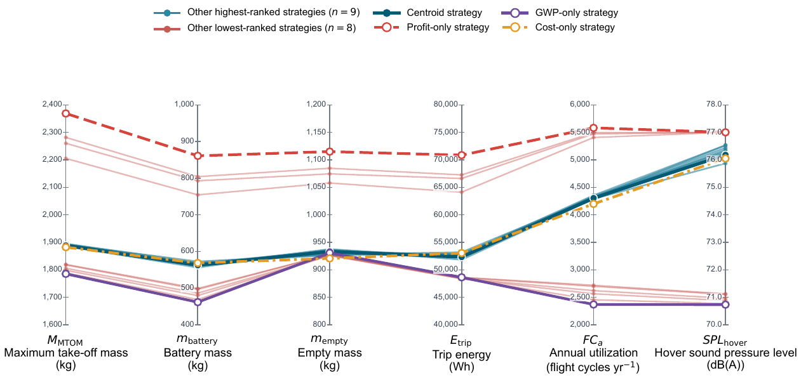
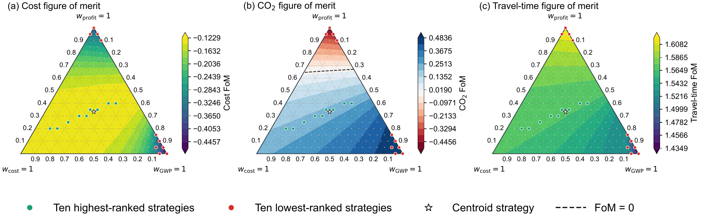

# Preference-Robust eVTOL Design

Research prototype for exploring early-stage eVTOL design decisions when the future weighting of operating cost, lifecycle GWP, and annual profit is uncertain.

<p align="center">
  
</p>

## Model concept

The multidisciplinary model maps design and operating decisions to performance, normalized single-criterion utility, and system value:

$$
\mathbf{x}\;\longrightarrow\;\mathbf{y}(\mathbf{x},\boldsymbol{\theta})
\;\longrightarrow\;\mathbf{u}(\mathbf{y})
\;\longrightarrow\;v(\mathbf{x},\mathbf{w})=\mathbf{w}^{\mathsf T}\mathbf{u}(\mathbf{y}).
$$

- $\mathbf{x}$: aircraft and operational design variables
- $\boldsymbol{\theta}$: technical and operational parameters
- $\mathbf{y}$: raw performance outcomes
- $\mathbf{u}\in[0,1]^K$: normalized criterion utilities
- $\mathbf{w}$: uncertain preference weights

The current criteria are:

$$
\mathbf{u}=\left[u_{\mathrm{cost}},\;u_{\mathrm{GWP}},\;u_{\mathrm{profit}}\right]^{\mathsf T}.
$$

<p align="center">
  
</p>

## Preference uncertainty

No probability distribution is assigned to the weights. Plausible valuation regimes are represented by a simplex lattice:

$$
\mathcal{W}_{\Delta w}=\lbrace\mathbf{w}\geq 0 \mid \sum_{k=1}^{K}w_k=1,\; w_k\in\lbrace 0,\Delta w,\ldots,1\rbrace\rbrace.
$$

For three criteria, $\Delta w=0.05$ gives 231 lattice scenarios; the centroid is added as a reference design.

<p align="center">
  
</p>

The lifecycle interpretation motivates the research question. The present implementation evaluates an **unordered set of plausible weights**; it does not yet model or predict a time-dependent path $\mathbf{w}(t)$.

<p align="center">
  
</p>

## Robust decision analysis

For each valuation scenario $\mathbf{w}_j$, the model generates a scenario-optimal design:

$$
\mathbf{x}_j^*=\arg\max_{\mathbf{x}\in\mathcal X}\;\mathbf{w}_j^{\mathsf T}\mathbf{u}(\mathbf{y}(\mathbf{x},\boldsymbol{\theta})).
$$

All candidate designs are then evaluated across all valuation scenarios:

$$
V_{ji}=\mathbf{w}_j^{\mathsf T}\mathbf{u}(\mathbf{y}(\mathbf{x}_i,\boldsymbol{\theta})),
\qquad
r_{ji}=\max_{\ell}V_{j\ell}-V_{ji}.
$$

The current pipeline reports the minimax-regret design,

$$
\mathbf{x}^{\mathrm{MMR}}=\arg\min_i\max_j r_{ji},
$$

and exports the utility and regret matrices for comparison using Wald, Savage, Laplace, and Hurwicz criteria.

## Current demonstrator

Implemented:

- deterministic low-fidelity eVTOL MDO model;
- linear utility normalization for cost, GWP, and profit;
- set-based preference uncertainty over the complete three-weight simplex;
- scenario-specific optimization and centroid reference design;
- cross-scenario utility and regret evaluation;
- CSV summaries for design, performance, utility, and regret.

<p align="center">
  
</p>

The demonstrator reveals a family of similarly robust designs rather than a single sharply defined optimum. Vulnerability is concentrated near specialized valuation regimes.

<p align="center">
  
</p>

## Run

```bash
python "Robust Decision Making/run_rdm_fixed_baseline.py" --step 0.05
```

Each run creates a timestamped folder under `Robust Decision Making/results/` containing candidate summaries, cross-evaluation matrices, regret matrices, and a run summary.

## Scope and next steps

This repository is an exploratory research demonstrator, not a validated aircraft-design or certification tool. Planned extensions include bounded and probabilistic preference information, nonlinear utility functions, probabilistic parameter uncertainty, and adaptive vehicle-operation co-design.

## Model provenance and citation

The underlying eVTOL multidisciplinary design model builds on:

> **Janning, J., Armanini, S. F., & Fasel, U. (2024).** [Future Pathways for eVTOLs: A Design Optimization Perspective](https://doi.org/10.48550/arXiv.2412.18078). *arXiv:2412.18078 [eess.SY]*.

If you use this research code, please cite the repository using GitHub's **Cite this repository** function and the underlying model paper above. A software DOI can be added after archiving a stable release.
